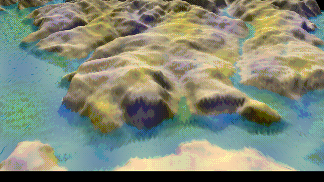

# C++ Water Surface Simulation with OpenGL

A real-time water surface simulation written in C++ using OpenGL.  
Features include interactive **rain**, **wave propagation**, **rising water levels**, and the ability to import a **greyscale image as a height map** to shape the terrain.

---

## 🖼️ Features

- ✅ **Real-time simulation** of water height and velocity across a grid
- 🌧️ **Rain system**: Simulate rainfall and water accumulation
- 🌊 **Wave propagation**: Disturbances generate natural wave patterns
- 🗺️ **Height map support**: Load a greyscale image to define terrain elevations
- 🌡️ **Rising water**: Gradual water level increase to simulate flooding
- 🔺 Rendered with **OpenGL** (C++98-compatible)
- 🧪 Physics-based model (velocity, acceleration, damping)

---

## 🖥️ Preview

  
  
*Rain and wave interaction over custom terrain*

---

## 🛠️ Technologies

- **C++**
- **OpenGL** (core rendering)
- **GLFW** (window/input)
- **stb_image** (height map loading)
- Custom-built physics and grid system

---

## 🚀 Run It

```bash
make
./mod1 path/to/heightmap.png
